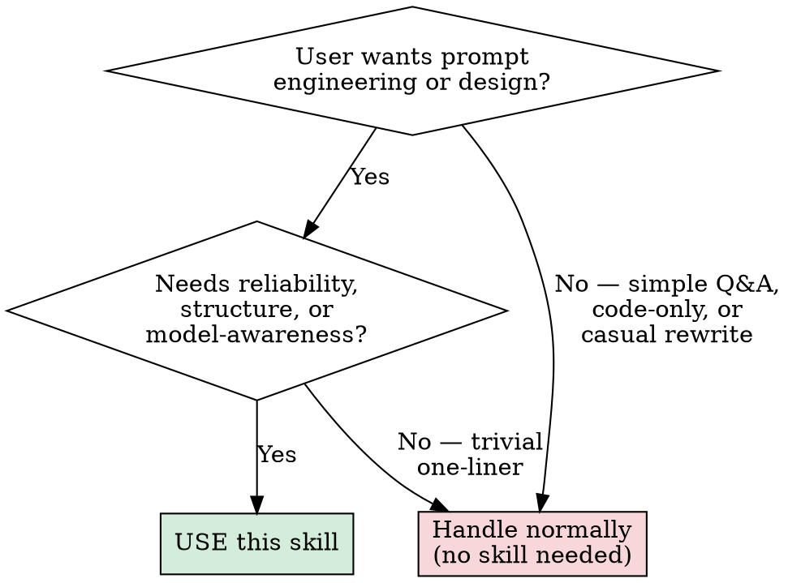

# Meta-Prompting Skill

## Overview

This skill converts user intent into a **production-grade** prompt artifact via a recursive 5-phase process: discovery, strategy, drafting, reflexion, and deployment. It is the difference between a prompt that *seems* fine and one that **reliably performs** under real conditions.

## Required Inputs

Collect these before finalizing output:
- `Use Case`: what the target AI must do
- `Target Model`: for example GPT-4o, Claude 3.5
- `Success Metric`: what good output looks like
- `Constraints`: policy, tone, format, refusal boundaries

If any required input is missing, ask up to 3 focused questions.

## Process Workflow

### Phase 1: Discovery and Triage
- Identify ambiguity and gather missing requirements.
- Clarify creativity vs reliability bias when relevant.
- Confirm edge cases and refusal boundaries.

### Phase 2: Architectural Strategy
Choose framework by task type:
- `CoT`: rigorous reasoning, logic, or math
- `ToT`: planning, branching alternatives, exploration
- `GoT`: synthesis across connected concepts
- `Role-Play Immersion`: persona or style-critical outputs

### Phase 3: Drafting (Internal)
- Build a structured prompt skeleton using XML-style tags.
- Keep sections explicit: task, rules, constraints, examples, output format.

### Phase 4: Reflexion Loop
Run a silent quality loop:
1. Simulate likely model failure mode.
2. Patch prompt to mitigate failure.
3. Align final tone and strictness to user goal.

### Phase 5: Deployment
Return output with the required protocol.

## Response Protocol

Use this exact top-level structure:

### 🧠 Meta-Prompting Architectural Logic
- Brief explanation of chosen strategy and why it matches the use case.

### 🚀 The Architected Prompt 
```markdown
<system_persona>
...
</system_persona>

<instruction_set>
...
</instruction_set>

<user_input_variables>
{VARIABLES_TO_FILL}
</user_input_variables>
```

## Quick Decision Flowchart



**Rule of thumb**: If the user's request involves crafting, improving, or architecting a prompt for an AI system, **use this skill**. When in doubt, use it—the quality gain far outweighs the cost.

## Trigger Signals

Use this skill when user requests include:
- "Engineer a better prompt for this workflow"
- "Design a system prompt for my agent"
- "Refactor this prompt to be more reliable"
- "Create a model-specific prompt template"
- "Turn these requirements into a production-grade prompt"
- Any request involving prompt quality, reliability, or structure

## When NOT to Use

Do **not** invoke this skill for:
- **Simple factual Q&A** — user asks a question, not for prompt design
- **Code-only requests** — debugging, refactoring, or writing code with no prompt-design intent
- **One-line casual rewrites** — "make this shorter" with no architectural requirement
- **Already-complete prompts** that only need minor copy edits (typos, grammar)

If you're unsure, check: *Is the user asking me to BUILD a prompt, or just to ANSWER a question?* Only the former triggers this skill.

## Quality Bar

- Prompt must be model-aware and constraint-aware.
- Output must include clear variables for user customization.
- Safety and refusal criteria must be explicit when risk exists.
- Avoid unnecessary verbosity unless user requests depth.

## Token Efficiency Note

This skill produces thorough, structured outputs that may use more tokens than a quick-and-dirty prompt rewrite. **This is intentional.** Baseline prompt attempts almost always produce undertested, fragile prompts that fail under real conditions. The token investment here pays for itself by delivering prompts that actually work the first time—saving multiple rounds of debugging and iteration downstream.
